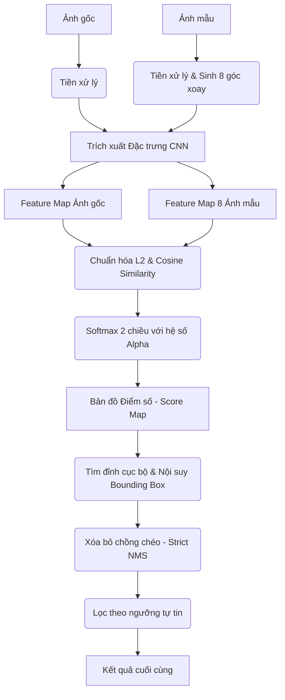

# Tài liệu Kỹ thuật: Hệ thống Khớp mẫu (Template Matching) với CNN Đa Góc Độ

## 1. Phân tích bài toán và lý do chọn hướng tiếp cận
- **Bài toán đặt ra:** Hệ thống cần tìm kiếm chính xác vị trí của một mẫu (template) xuất hiện bên trong một hình ảnh gốc lớn (thường là các bản vẽ kỹ thuật phức tạp). Các đối tượng trong thực tế có thể bị xoay theo nhiều hướng khác nhau, hoặc chịu nhiễu làm giảm chất lượng ảnh.
- **Hướng tiếp cận:** Thay vì dùng các phương pháp truyền thống so sánh trực tiếp màu sắc pixel, giải pháp ở đây là dùng mạng nơ-ron chập (CNN) để trích xuất đặc trưng của ảnh rồi mới đem so khớp. Luồng xử lý chia làm 3 bước chính:
  1. *Trích xuất đặc trưng:* Dùng một mô hình CNN có sẵn để đọc cả ảnh gốc và ảnh mẫu. Khi đi qua mạng này, ảnh sẽ biến thành các khối đặc trưng chứa thông tin về hình dáng, góc cạnh thay vì pixel thô. Đồng thời, để xử lý việc đối tượng trên thực tế có thể bị xoay, ảnh mẫu sẽ được tự động xoay ra thành 8 góc khác nhau trước khi mang đi so sánh.
  2. *So khớp:* Lấy đặc trưng của mẫu trượt qua đặc trưng của ảnh gốc và tính toán độ tương đồng bằng hàm Cosine. Bước này sẽ sinh ra một bản đồ điểm số (Score Map), nơi mỗi điểm trên bản đồ thể hiện mức độ tự tin xem đối tượng có nằm tại vị trí đó hay không.
  3. *Khoanh vùng và Hậu xử lý:* Dựa vào bản đồ điểm số, ta đi dò tìm các đỉnh cục bộ (các điểm có điểm số cao nhất trong vùng của nó). Những điểm này chính là tọa độ tâm của đối tượng. Từ điểm tâm này, ta bù trừ theo kích thước để vẽ ra khung Bounding Box thực tế. Cuối cùng, dùng thuật toán triệt tiêu các box đè lên nhau (NMS) kết hợp với các ngưỡng điểm số để gạn lọc hết các cảnh báo giả, chỉ chừa lại kết quả chuẩn xác nhất.

## 2. Kiến trúc hệ thống tổng quan (Sơ đồ Pipeline)

## 3. Giải thích chi tiết từng module

### 3.1. Tiền xử lý (Preprocessing)
- Hình ảnh đầu vào được chuẩn hóa kích thước, chuyển sang không gian màu RGB và normalize giá trị pixel về dải tensor tiêu chuẩn cho mạng neural (ví dụ: dùng định mức trung bình và độ lệch chuẩn của ImageNet).
- **Sinh mẫu đa góc (Rotation Augmentation):** Từ ảnh template ban đầu, hệ thống thực hiện phép xoay (rotate) sinh ra 8 biến thể ứng với các góc ($0^\circ, 45^\circ, 90^\circ, 135^\circ, 180^\circ, 225^\circ, 270^\circ, 315^\circ$). Khi xoay, ảnh được thêm padding (vùng đệm) cẩn thận để không làm đứt gãy chi tiết quan trọng.

### 3.2. Trích xuất đặc trưng (Feature Extraction)
- Sử dụng mô hình CNN pre-trained (như ConvNeXt, EfficientNet, MobileNet) làm backbone.
- Hệ thống không trích xuất đặc trưng ở tầng cuối cùng (classification layer), mà ngắt mạng ở các tầng tích chập trung gian (intermediate convolutional layers). Tại đây, feature map giữ được đủ độ phân giải để có thể định vị tọa độ (localization), và học được các hình khối (shapes/edges) đặc trưng, thích hợp nhất cho việc tìm kiếm đối tượng có trong bản vẽ.

### 3.3. Khớp mẫu (Tính toán độ tương đồng)
Quá trình so khớp sử dụng **Cosine Similarity** trên không gian đặc trưng (Feature Map). Các bước tính toán bao gồm:
- **Chuẩn hóa (Normalization):** Trước khi nhân ma trận, feature map được chuẩn hóa 2 bước:
  1. *Z-score Normalization:* Tính `mean` và `std` trên toàn bộ tập pixel của ảnh gốc và template để chuẩn hóa `(x - mean) / std`, giúp cân bằng cường độ đặc trưng.
  2. *L2 Normalization:* Từng vector đặc trưng tại mỗi pixel được chuẩn hóa độ dài L2.
- **Tính độ tương đồng:** Sử dụng tích vô hướng (thông qua hàm `torch.einsum`) trượt template trên ảnh gốc. Đối với các vector đã chuẩn hóa L2, tích vô hướng chính là giá trị Cosine Similarity.
- **Tính điểm tự tin (Confidence Score):** Thay vì sử dụng trực tiếp giá trị Cosine, ma trận kết quả được nhân với hệ số **Alpha** và đưa qua hàm Softmax 2 chiều.
  - *Ý nghĩa hệ số Alpha:* Alpha hoạt động như một nhiệt độ (temperature) scale. Giá trị Alpha lớn giúp phân phối Softmax sắc nét (peaked) hơn, phóng đại khoảng cách giữa các điểm khớp tốt và các điểm nhiễu, từ đó làm tăng độ phân giải của cực đại cục bộ.
  - *Giới hạn giá trị:* Quá trình áp dụng Softmax và lấy căn bậc hai đảm bảo "Score Map" cuối cùng luôn hội tụ trong khoảng giá trị `[0.0, 1.0]`, biểu diễn chính xác độ tự tin (confidence score).

### 3.4. Hậu xử lý (Post-processing)
Thực chất bước này hoạt động phức tạp và khác biệt so với NMS (Non-Maximum Suppression) thông thường. Quá trình này (hàm `extract_bboxes_from_heatmap_multi`) trải qua 5 bước:

1. **Lọc tương đối toàn cục:** Hệ thống đánh giá sơ bộ điểm số cực đại (max score) của tất cả template. Những template nào có điểm cực đại nhỏ hơn 10% so với điểm cao nhất toàn cục sẽ bị loại bỏ hoàn toàn.
2. **Lọc đỉnh cục bộ:** Trên Score Map của mỗi template còn lại, hệ thống không dùng một ngưỡng cố định (absolute threshold) mà trích xuất các pixel có điểm số cao hơn một ngưỡng tương đối: `(thresh * điểm_cực_đại_của_chính_template_đó)`. Cách làm này đảm bảo rằng template nào cũng có cơ hội tìm ra được "vị trí tốt nhất" của nó (local peaks).
3. **Chuyển đổi thành Bounding Box & Sắp xếp:** 
   - *Đồng bộ không gian:* Trước đó, Score Map (vốn bị thu nhỏ ở tầng Feature Map) đã được phóng to (upscale) về đúng kích thước pixel của ảnh gốc. 
   - *Xác định tọa độ:* Mỗi pixel (đỉnh cục bộ) thỏa mãn điều kiện ở bước 2 mang ý nghĩa là **tọa độ tâm (center)** của đối tượng trên ảnh thật.
   - *Nội suy Bounding Box:* Từ tọa độ tâm `(x_center, y_center)`, hệ thống bù trừ dựa trên chiều rộng (W) và chiều cao (H) thực tế của template tương ứng để tính ra tọa độ góc hộp (ví dụ: `x1 = x_center - W/2`, `y1 = y_center - H/2`).
   - Toàn bộ box ứng viên sau đó được gộp chung lại và sắp xếp theo điểm số tự tin từ cao xuống thấp.
4. **Xóa bỏ chồng chéo nghiêm ngặt:** 
   - Box có điểm cao nhất luôn được giữ lại.
   - Hệ thống xóa bỏ tất cả các box còn lại nếu có diện tích giao nhau (IoU) với box chuẩn > 0.05. Điểm khác biệt cốt lõi với NMS thường: NMS tiêu chuẩn dùng ngưỡng IoU 0.4 - 0.5 để xóa các box miêu tả *cùng một* đối tượng. Ở đây, ngưỡng IoU cực thấp (0.05) giả định rằng các template **không được phép đè lên nhau hoặc giao nhau**. Mọi sự giao cắt dù là nhỏ nhất (5%) đều bị triệt tiêu để giữ lại box tự tin hơn.
5. **Lọc theo ngưỡng tự tin (Absolute Confidence Threshold):** Sau bước trên, hệ thống mới áp dụng một ngưỡng độ tin cậy tuyệt đối (cấu hình qua giao diện UI - `conf_thresh`) để loại bỏ các box có điểm số quá thấp, đảm bảo chỉ hiển thị các kết quả có độ chính xác cao nhất.

## 4. Đánh giá ưu/nhược điểm của phương pháp đã chọn

**Ưu điểm:**
- **Tính ổn định (Robustness) cao:** Do khớp nối trên không gian ngữ nghĩa, hệ thống bỏ qua được nhiễu pixel, các nét đứt đoạn, thay đổi phông nền mà phương pháp cũ bó tay.
- **Phát hiện mọi góc xoay (Rotation-invariant):** Giải quyết dứt điểm rào cản tìm kiếm các đối tượng bị lệch hoặc vẽ xoay ngược thông qua pipeline 8 góc độ kết hợp NMS thông minh.
- **Dễ dàng tuỳ biến:** Có thể thay đổi ngưỡng confidence hoặc đổi backbone nhẹ hơn (MobileNet) để chạy trên máy yếu.

**Nhược điểm:**
- **Chi phí phần cứng:** Đòi hỏi nhiều bộ nhớ RAM/VRAM để chạy song song 8 luồng trích xuất feature từ mẫu.
- **Tốc độ xử lý (Latency):** Tốn nhiều thời gian chạy hơn hẳn so với OpenCV cơ bản, đặc biệt trên các bản vẽ độ phân giải khổng lồ nếu không có phần cứng GPU tăng tốc.

## 5. Hạn chế hiện tại và Hướng cải thiện nếu có thêm thời gian
- **Hạn chế về Kích thước (Scale-invariant):** Hiện tại hệ thống **chưa hỗ trợ đa tỉ lệ (Scale)**. Thuật toán sliding window trên feature map dựa vào kích thước kernel cứng. Nếu mẫu bên trong ảnh gốc được vẽ to hoặc nhỏ hơn rõ rệt so với ảnh template ban đầu, kernel sẽ không khớp, dẫn đến hệ thống bị bỏ sót kết quả.
- **Hướng cải thiện dự kiến:**
  1. **Image Pyramid (Tháp ảnh):** Thay vì chỉ xoay góc, ta có thể kết hợp scale kích thước template ban đầu thành nhiều mức (ví dụ 0.5x, 0.75x, 1x, 1.25x, 1.5x). Bù lại, lượng template cần xử lý sẽ là `(số góc) x (số scale)`, nên đòi hỏi quản lý batch trên GPU thật tốt.
  2. **Feature Pyramid Network (FPN):** Sử dụng các kiến trúc có nhánh phụ như FPN, tổng hợp đặc trưng ở đa mức phân giải (multi-resolution), giúp tìm kiếm đối tượng ở mọi kích cỡ mà không cần tạo hàng chục template thủ công.
  3. **Xuất mô hình (Export Model):** Biến đổi toàn bộ pipeline backbone sang chuẩn ONNX hoặc TensorRT để tận dụng tối đa băng thông phần cứng, cắt giảm 50% thời gian xử lý so với PyTorch gốc.

## 6. Kết quả benchmark trên test cases tự tạo0
- **Test Case 1: Đối tượng ở góc xoay chuẩn (0 độ), rõ nét.**
  - **Độ chính xác (Recall):** phát hiện tốt các đối tượng 
  - **Cảnh báo giả (False Positive Rate):** vẫn đang có 1 - 2 box 
- **Test Case 2: Đối tượng bị xoay nhiều góc (45, 90, 180 độ) trong cùng một ảnh.**
  - **Độ chính xác:** Vẫn phát hiện tốt các đối tượng 
  - **Cảnh báo giả (False Positive Rate):** 3 - 5 box bị sai do góc xoay quá lớn khiến feature map bị lệch 
- **Test Case 3: Đối tượng bị thay đổi tỉ lệ lớn (Scale 1.5x hoặc 0.5x).**
  - **Độ chính xác:** Chỉ khớp các hình thù quá nổi bật, còn lại thất bại.

