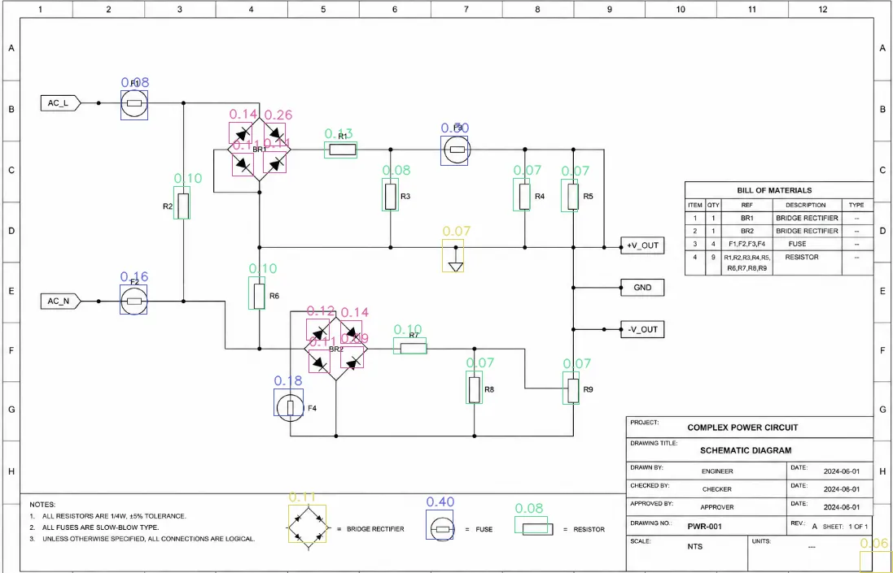
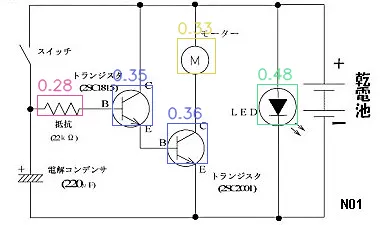

# Template Matching (OpenCV + CNN verification)

Dự án này triển khai khớp mẫu (template matching) đa tỉ lệ và đa góc xoay bằng OpenCV, sau đó **tùy chọn** xác nhận lại bằng CNN (ConvNeXt Tiny, EfficientNet B4, MobileNetV3). Phù hợp cho bản vẽ kỹ thuật đen trắng và ảnh có nhiều template cần so khớp.

> 📖 **Tài liệu kỹ thuật chi tiết:** xem [docs/Docs.md](docs/Docs.md)

## Ảnh demo kết quả





## Cài đặt

1. Tạo môi trường ảo:
   ```bash
   python -m venv .venv
   .\.venv\Scripts\Activate.ps1
   ```
2. Cài đặt phụ thuộc:
   ```bash
   pip install -r requirements.txt
   ```

## Thư mục dữ liệu

- `sample/`: ảnh cần so sánh
- `template/`: ảnh template

## Cách dùng

### 1. Giao diện Gradio

```bash
python app.py
```

- Chọn ảnh cần so sánh và các template.
- Điều chỉnh các tham số khớp mẫu và (tùy chọn) bật CNN để lọc kết quả.

### 2. Chạy CLI

```bash
python main.py --image sample\sample2.png --template-dir template --output-image output.png --output-json output.json
```

## Tham số CLI và ý nghĩa

Các tham số chính (xem đầy đủ bằng `python main.py --help`):

- `--image`: đường dẫn ảnh cần so khớp.
- `--templates`: danh sách đường dẫn template (có thể nhiều file).
- `--template-dir`: thư mục chứa template.
- `--output-image`: đường dẫn ảnh kết quả.
- `--output-json`: đường dẫn JSON kết quả.
- `--match-threshold`: ngưỡng điểm khớp của `cv2.matchTemplate`.
- `--cosine-threshold`: ngưỡng cosine similarity (khi bật CNN).
- `--iou-threshold`: ngưỡng IoU để NMS.
- `--match-method`: phương pháp matchTemplate (`TM_CCOEFF_NORMED` hoặc `TM_CCORR_NORMED`).
- `--angles`: danh sách góc xoay template, cách nhau bởi dấu phẩy.
- `--scale-min`: tỉ lệ scale nhỏ nhất của template.
- `--scale-max`: tỉ lệ scale lớn nhất của template.
- `--scale-steps`: số bước scale trong khoảng min–max.
- `--model`: backbone CNN dùng để xác nhận (ví dụ `convnext_tiny`, `efficientnet_b4`).
- `--max-detections`: giới hạn số bbox mỗi template trước khi NMS.
- `--no-mt`: tắt đa luồng.
- `--no-cnn`: tắt bước xác nhận bằng CNN.

## Ghi chú

- Lần chạy đầu sẽ tải trọng số CNN từ Hugging Face (timm).
- Khi tắt CNN, kết quả chỉ dựa trên OpenCV template matching.

## Hướng phát triển dự kiến

1. Viết lại pipeline bằng C++ để tối ưu tốc độ.
2. **Xuất mô hình (Export Model)**: chuyển backbone sang ONNX hoặc TensorRT để tận dụng tối đa băng thông phần cứng, giảm thời gian xử lý so với PyTorch gốc.
