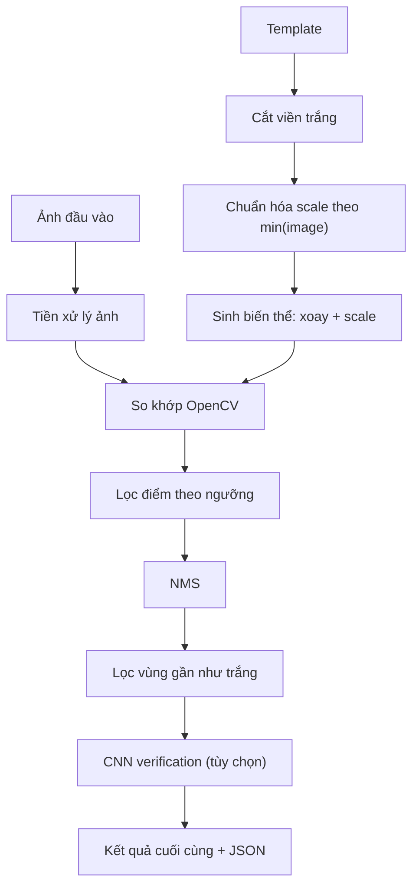

# Tài liệu kỹ thuật: Hệ thống Template Matching hiện tại

## 1. Phân tích bài toán và lý do chọn hướng tiếp cận

- **Bài toán:** Tìm vị trí các đối tượng (template) trong ảnh lớn, có thể xoay và thay đổi tỉ lệ, đặc biệt là bản vẽ kỹ thuật đen trắng.
- **Hướng tiếp cận:** Dùng `cv2.matchTemplate` để so khớp trực tiếp trên ảnh (nhanh, đơn giản, dễ kiểm soát), kết hợp **đa tỉ lệ + đa góc** để tăng khả năng bao phủ. Kết quả được lọc bằng NMS và (tùy chọn) **CNN verification** để giảm false positive.

## 2. Kiến trúc hệ thống tổng quan (Sơ đồ pipeline)

## 3. Giải thích chi tiết từng module

### 3.1. Preprocessing

- **Tiền xử lý ảnh đầu vào:** chuyển ảnh sang grayscale để ổn định so khớp trên bản vẽ đen trắng.
- **Cắt viền trắng:** dùng thuật toán cắt theo ngưỡng sáng (threshold) trên ảnh xám để tìm vùng có nét vẽ, sau đó lấy bounding box nhỏ nhất bao quanh vùng đó. Lý do: nhiều template có padding trắng khiến vùng khớp bị lệch và tăng false positive; loại bỏ viền giúp tập trung vào hình học thực của ký hiệu.
- **Chuẩn hóa scale theo min(image):** sau khi cắt viền, template được scale sao cho **cạnh nhỏ nhất** bằng **0.1 × cạnh nhỏ nhất của ảnh đầu vào**. Đây là tỉ lệ trung gian phù hợp cho các ký hiệu kỹ thuật, đồng thời tạo nền tảng tốt khi kết hợp với dải scale tiếp theo.
- **Sinh biến thể: xoay + scale:**
  - **Góc xoay:** $0^\circ, 45^\circ, 90^\circ, 135^\circ, 180^\circ, 225^\circ, 270^\circ, 315^\circ$.
  - **Scale:** trong khoảng **ngưỡng nhỏ nhất** → **ngưỡng lớn nhất** theo **số bước scale** (mặc định: 0.1 → 2.0, 10 bước).

### 3.2. Process (Matching)

- Dùng `cv2.matchTemplate` để trượt template (đã xoay/scale) trên ảnh đầu vào và tính **độ tương đồng theo từng vị trí**.
- Hệ thống hỗ trợ `TM_CCOEFF_NORMED` và `TM_CCORR_NORMED`.
  - `TM_CCOEFF_NORMED`: tính **tương quan chéo có trừ trung bình** rồi chuẩn hóa theo năng lượng (variance) của cả template và vùng ảnh. Công thức dạng:
    $$R(x,y)=\frac{\sum (T-\bar{T})(I-\bar{I})}{\sqrt{\sum (T-\bar{T})^2\sum (I-\bar{I})^2}}$$
    Trong đó $T$ là ma trận template, $I$ là vùng ảnh con tại vị trí $(x,y)$, $\bar{T}$ và $\bar{I}$ là trung bình cường độ, $\sum$ là tổng trên toàn bộ pixel trong cửa sổ so khớp.
    Ổn định khi nền sáng/tối thay đổi, phù hợp bản vẽ có độ sáng không đồng đều.
  - `TM_CCORR_NORMED`: tính **tương quan chéo trực tiếp** rồi chuẩn hóa theo năng lượng:
    $$R(x,y)=\frac{\sum (T\cdot I)}{\sqrt{\sum T^2\sum I^2}}$$
    Ký hiệu $T\cdot I$ là tích theo từng pixel, còn mẫu số là chuẩn $L2$ của template và vùng ảnh con, giúp giá trị điểm khớp nằm trong khoảng $[0,1]$.
    Nhạy với độ tương phản/độ đậm nét, có thể tốt khi nét vẽ rõ và nền sạch.
- Kết quả là **bản đồ điểm khớp**, lấy các vị trí có điểm >= **ngưỡng khớp**.

### 3.3. Post-processing

- **Lọc điểm theo ngưỡng:** giữ lại các vị trí có điểm khớp đủ cao.
- **NMS:** loại bbox chồng lặp theo IoU.
- **Lọc vùng gần như trắng:** sau khi crop theo bbox, chuyển sang ảnh xám và tính tỷ lệ pixel tối (dưới ngưỡng sáng). Nếu tỷ lệ này nhỏ hơn ngưỡng tối thiểu thì coi như nền trắng và loại bỏ.
- **CNN verification (tùy chọn):** crop ảnh theo bbox, resize template tương ứng về cùng kích thước crop, trích embedding (ConvNeXt/EfficientNet/MobileNet) và lọc theo **ngưỡng cosin**.
- **Kết quả cuối cùng:** vẽ bbox + điểm và xuất JSON.

## 4. JSON output

Mỗi phần tử có các trường:

- `template_name`: tên file template.
- `bbox`: (x, y, w, h).
- `match_score`: điểm template matching.
- `angle`: góc xoay template.
- `scale`: tỉ lệ scale.
- `cosine_similarity`: điểm CNN (null nếu tắt CNN).

## 5. Đánh giá ưu/nhược điểm

**Ưu điểm**

- Dễ kiểm soát, dễ tinh chỉnh tham số.
- Hiệu quả cho bản vẽ kỹ thuật đen trắng khi template có cấu trúc rõ.
- Có cơ chế lọc nền trắng và CNN verification để giảm false positive.

**Nhược điểm**

- Chi phí tính toán tăng theo số góc và số bước scale.
- Dễ bỏ sót nếu tỉ lệ thực tế lệch nhiều hoặc template bị biến dạng mạnh.
- CNN verification tăng thời gian chạy.

## 6. Hạn chế hiện tại và hướng cải thiện

- **Chưa có cơ chế scale thích nghi**: vẫn cần dò nhiều scale.
- **Chưa có chiến lược** để tăng tốc.

**Hướng cải thiện:**

1. Viết lại pipeline bằng C++ để tối ưu tốc độ.
2. **Xuất mô hình**: chuyển backbone sang ONNX hoặc TensorRT để tăng tốc so với PyTorch gốc.

## 8. Benchmark trên test cases tự tạo

1. Hệ thống nhận diện tốt với các template có cấu trúc rõ ràng, ít bị biến dạng, xoay trong phạm vi đã định (ví dụ 45°, 75°, 90°).
2. Độ chính xác giảm khi template bị vẽ quá to hoặc quá nhỏ so với tỉ lệ chuẩn, hoặc khi có nhiều nhiễu nền trắng, mặc dù đã có bước chuẩn hoá kích thước, sinh biến thể đa tỉ lệ, và lọc nền trắng.
3. CNN verification giúp giảm false positive nhưng tăng thời gian xử lý, nhất là khi số lượng bbox ứng viên lớn. Trong thực nghiệm nội bộ, EfficientNet B4 cho embedding ổn định và phân biệt template tốt hơn các lựa chọn còn lại. Để phù hợp domain bản vẽ kỹ thuật đen trắng, nên fine-tune backbone trên dữ liệu cùng miền nhằm tăng khả năng tách template với nền trắng.

## 9. Ảnh demo kết quả

